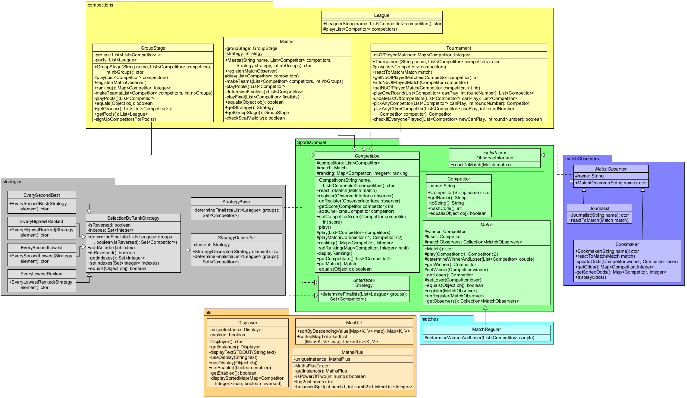

# Projet COO L3S5

# Rendu final

## Dépôt *git* du binôme **Alexandre Ledun** et **Théo Serra**

# Troisième  version

* *Note* : les `Main` s'exécutent toujours de la même façon qu'à la V2 précédente (cf instructions);
* ajout d'un `Bookmaker` et d'un `Journalist` à chaque `Main` de compétition;
* ajout d'une classe `Bookmaker` et d'une classe `Journalist` (cf _Présentation d'éléments saillants_) et rédaction des tests correspondants;
* ajout d'une interface `ObserverInterface` et son implémentation abstraite `MatchObserver` dont héritent les `Competition`, le `Bookmaker` et le `Journalist`;
* passage des attributs précédemment dans le `Competitor` vers les `Competition` quand pertinent (score et nombre de matchs joués), évitant finalement de devoir réinitialiser les `Competitor` à la fin du `GroupStage` au cours d'un `Master`, et permettant également que chaque classe ne s'occupe que de données qui lui sont utiles; réorganisation des méthodes et des tests correspondants;
* diverses améliorations faites à l'affichage : abstraction de l'affichage de hashmap (réutilisé de deux façons différentes par `Bookmaker` et `Competition`); suppression de l'attribut `String competType` des `Competition` car remplacé fonctionnellement par l'attribut `name` hérité de `MatchObserver`; formatage de l'affichage des rankings et cotes pour que les noms des compétiteurs et le numéro associé (score ou cote) soient alignés sur une colonne...

# Deuxième version

* ajout au `README.md` des lignes de commandes relatives à la création du jar et au lancement de la classe `Main` du `Master`;
* ajout d'une classe utilitaire `RandomCompetitorGenerator` dans le paquet `Util` pour générer facilement un certain nombre de compétiteurs dans les `Main`;
* ajout d'une classe `Master` et d'une classe `GroupStage` (cf _Présentation d'éléments saillants_) et rédaction des tests correspondants;
* ajout d'une interface `Strategy` et de ses diverses implémentations `StrategyBase`, `StrategyDecorator`, `SelectionByRankStrategy`, `EveryHighestRanked`, `EverySecondBest`, `EveryLowestRanked`, `EverySecondLowest` (cf _Présentation d'éléments saillants_) et rédaction des tests correspondants;
* ajout à la classe `Displayer` d'une méthode `setEnable` qui peut être mise à `false` pour désactiver l'affichage de la trace sur la sortie standard si besoin;
* ajout à la classe `MapUtil` d'une méthode `sortedMapToLinkedList` pour manipuler la liste triées par score des compétiteurs sans passer par une map;
* diverses améliorations faites à l'affichage de la trace notamment via l'ajout d'un attribut `String competType` aux `Competition` pour pouvoir préciser dans l'affichage quel type de compétition se déroule;

## UML



## Introduction du sujet

* Le projet consiste à implémenter la gestion de matchs joués entre des couples de compétiteurs par un évènement type compétition sportive.

* Il s'agit de donner la possibilité de jouer plusieurs types de compétitions (le tournois avec élimination des perdants au fur et à mesure, le championnat avec matchs aller-retour entre chaque compétiteur, et le master, avec une phase de sélections (pools) où les compétiteurs sont répartis en groupes au sein desquels ils se font face au cours d'un championnat, puis des finalistes sont sélectionnés selon une stratégie pour aller jouer la finale consistant en un tournois).

* Il est possible d'implémenter facilement de nouvelles stratégies de sélection pour les masters, de nouveaux types de matchs, de nouveaux types de compétitions, de nouveaux observateurs comme les journalistes et les bookmakers déjà implémentés, etc... par héritage de classes.

## Mettre en place les fichiers pour exécution

### Récuperation du dépôt

* Afin d'accéder au projet il faut télécharger l'archive du dépôt sur la platforme Git, puis en extraire le contenu dans votre espace de travail.

* Ouvrir le dossier obtenu et y naviguer depuis l'invite de commande

### Création de tous les jars et lancement du `MasterMain`

* **En entrant simplement `make` depuis la racine, vous lancerez la compilation, la création des jars, l'exécution du `MasterMain` fourni.**

* **Pour l'exécution des tests : attention à lire la *Note* de la partie "Lancement des tests".**

``` bash
$ make
```

* **A partir de la V2, une classe utilitaire a été créée permettant de générer automatiquement une liste de compétiteurs de la taille désirée. Il vous est facilement possible de modifier les classes `Main` pour modifier le nombre de compétiteurs créés, mais il vous faudra faire attention à respecter les propriétés intrinsèques à la compétition alors modifiée.**

### Génération de la documentation

* Faire `make doc` dans le répertoire racine

``` bash
$ make doc
```

* **Note: 3 warnings peuvent apparaître car les 3 méthodes *main* ne sont pas documentées.**

### Génération des archives exécutables

* Faire `make jarleague`, `make jartourn` et `make jarmaster` dans le répertoire racine

``` bash
$ make jarleague
```

``` bash
$ make jartourn
```

``` bash
$ make jarmaster
```

### Lancement des tests

* Faire `make tests` dans le répertoire racine

* **Note: Il sera indispensable d'indiquer dans le Makefile l'emplacement de votre .jar JUnit5 à la première ligne.**

``` bash
$ make tests
```

### Exécution des archives générées

* Pour lancer le main d'un Tournament, faire `make runTournament` dans le répertoire racine

``` bash
$ make runTournament
```

* Pour lancer le main d'une League, faire `make runLeague` dans le répertoire racine

``` bash
$ make runLeague
```

* Pour lancer le main d'un Master, faire `make runMaster` dans le répertoire racine

``` bash
$ make runMaster
```

## Présentation d'éléments saillants

### Elements de conceptions notables :

* Une classe abstraite `Competition` fut écrite à laquelle ont été ajoutées les classes `League` et `Tournament` via un lien d'héritage.
* Une classe abstraite `Match` a été implémentée permettant la création de Matchs différents héritant de celle-ci telle que notre classe `MatchRegular` offrant la victoire aléatoirement entre deux compétiteurs.
* Deux attributs **winner** et **loser** ont été ajoutés à la classe `Match` ce qui permet une implémentation plus succincte d'autres classes telle que `Tournament`.
* Un package `SportCompet.Util` permet la création de classes supplémentaires permettant l’ajout de méthodes utiles au développement sans qu'elle n'empiètent trop le code sources. On y retrouve notamment de quoi gérer l'affichage dans la classe `Displayer`, une méthode de tri pour Map dans `MapUtil` et des méthodes liés pour l'instant au puissances de deux dans `MathsPlus`. Quand possible, ces classes ont été codées de façon à ce qu'une seule instance puisse être créée et appelée de manière *static*.

**Nouveau en V2** :
* Une classe `GroupStage` héritant de `Competition` est responsable de prendre une liste de `Competitor` et la répartir en groupe équilibrés pour ensuite faire jouer chaque groupe dans une `League`.
* Une interface `Strategy` définit une stratégie comme devant définir pour méthode pour sélectionner des finalistes. L'idée étant que chacune des `Strategy` que nous fournissons puisse à la fois être décorée, ou elle-même décorer n'importe quelle autre `Strategy`. Nos `Strategy` permettant cela héritant de la classe abstraite `StrategyDecorator`, étant elle-même l'intermédiaire entre nos implémentations utilisables et l'interface `Strategy`, **il reste cependant possible d'ajouter ultérieurement des `Strategy` qui ne seront pas des `Decorator`** (mais elle resteront décorables), notre `StrategyBase` illustrant ce dernier point et ne sert pour le moment que de base à la "décoration" (sa méthode `defineFinalists` ne renvoyant qu'un Set vide). **Si ultérieurement nous avons besoin d'ajouter de nouvelles stratégies ne dépendant pas de `StrategyDecorator`, nous pourrions très facilement rendre `StrategyBase` abstraite et utiliser ses héritiers comme stratégies non décoratrices** (mais toujours décorables). `SelectionByRankStrategy` hérite ensuite de `StrategyDecorator` et **permet de sélectionner n'importe quels compétiteurs à partir de leur rang**, en partant du début ou de la fin du classement pour une manipulation plus simple (donc le premier de la liste inversée étant le compétiteur avec le score le plus faible). Bien qu'il soit possible de sélectionner virtuellement n'importe qui via cette classe, nous lui avons fait 4 sous-classes permettant une sélection assez évidente : sélectionner le premier, le deuxième, l'avant dernier, ou le dernier de chaque liste. Ensuite **par le jeu de la décoration il est possible de récupérer n'importe quel ensemble de compétiteurs imaginable**.
* Il est aussi à noter que nos `SelectionByRankStrategy` ont pour attribut un `Set` d'entiers qui correspond aux indexes recherchés, évitant d'itérer inutilement sur les listes de compétiteurs si des stratégies redondantes se décorent mutuellement. Nos `SelectionByRankStrategy` ignoreront les indexes plus grands que (ou égaux à) la taille de la liste de compétiteurs, mais si ultérieurement une `Strategy` est codée sans ce *fail-safe*, une erreur sera lancée et empêchera la création du `Master` décrit ci-dessous. De plus, nos `Strategy` renvoient un `Set` de compétiteurs, évitant également de renvoyer plusieurs fois le même `Competitor`.
* Une classe `Master` a un `GroupStage` et une `Strategy` en attribut, et une fois que la sélection est faite, les attributs des `Competitor` sont remis à zéro avant de les faire jouer dans une dernière compétition `Tournament` dont le vainqueur sera le vainqueur du `Master`. Si la `Strategy` et la liste de compétiteurs n'est pas compatible avec le nombre de groupes requis passés en paramètre à la construction du `Master`, celui ci ne pourra pas être créé (cela vise entre autres choses à vérifier que la stratégie appelée sur les groupes obtenus donnera bien un nombre de compétiteurs qui sera une  puissance de 2 pour lancer le `Tournament` final).

**Nouveau en V3** :
* Une interface `ObserverInterface` définit un observeur comme devant définir pour méthode pour réagir à un match. L'idée étant que chacune des `MatchObserver`, qui en héritent tout en s'ajoutant un attribut `name` permettant de les distinguer dans l'affichage, puissent réagir chacun d'une façon qui leur est propre. Cependant les `MatchObserver` ne s'abonnent à un `Match` que via la `Competition` à laquelle ils s'abonnent par la méthode `register`.
* Une classe `Journalist` affiche le résultat de chaque `Match` auquel il est enregistré (qui a gagné, qui a perdu); la classe `Bookmaker` mettra à jour sa liste des côtes (`odds`) pour chaque compétiteur de la compétition et l'affichera à la fin du match.
* La `Competition` hérite maintenant de `MatchObserver`, rajoutant donc un attribut `name` pour les affichages (qui supplante donc le précédent `competType`). Cela permet également de déplacer la responsabilité de compter les points vers les `Competition` pour leur `ranking`, ainsi que la responsabilité de compter le nombre de matchs joués vers les `Tournament` (qui sont les seuls `Competition` à utiliser cet attribut précédemment attribué au `Competitor`).

### Présentation des principes de conception mis en oeuvre :

* Bien entendu le DRY (**Don't Repeat Yourself**) et l'**Open-Close Principle** ont guidé la majorité des décisions prises au début de la conception, l'objectif étant de pouvoir à long terme rajouter de nouvelles classes facilement au projet en évitant au maximum de répéter du code.
* Nous avons également essayé d'implémenter les fonctionnalités de façon à respecter le **design de Singleton** quand nécessaire (un remaniement de la classe `Match` pourrait être prévu ultérieurement), notamment dans les classes de la V1 du paquet `Util` comment mentionné ci-dessus.
* Au cours de l'implémentation de `Tournament`, il a également été nécessaire de décomposer la méthode `play()` afin de donner à de nouvelles méthodes privées un rôle spécifique (selon le **principe de responsabilité unique**) dans l'organisation d'un round et l'élimination des `Competitor` perdants. Le principe de responsabilité unique a également motivé la création de `MathsPlus`, `Displayer`, et `GroupStage`, ce dernier étant responsable de la partie "sélection" du `Master`.
* L'implémentation des `Competition` et des `Strategy` avec leurs tests ont permis l'exercice d'**héritage de tests**.
* Le *pattern* de **template method** a permis a plusieurs moments via les héritages de permettre l'application de méthodes sans en répéter le code à travers les classes.
* Les `Strategy` appliquent à la fois le *pattern* de `Strategy` et de `Decorator`, permettant de créer n'importe quelle stratégie de sélection des compétiteurs, et de la décorer avec une autre ou d'être décorée par une autre.
* Les `MatchObserver` appliquent le *pattern* de `Observer`, permettant de créer n'importe quel observateur pour des match (via leur compétition respective). Ce faisant, nous avons pu réappliquer le principe de responsabilité unique en déplaçant la responsabilité de compter les points/les nombres de matchs joués vers les désormais *observers* `Competition` pertinentes.

## Liens utiles

* [Le sujet](https://www.fil.univ-lille1.fr/~quinton/coo/projet/competitionsV3.pdf)
* [Les consignes de rendu](https://www.fil.univ-lille1.fr/~quinton/coo/projet/consignesRenduProjet.pdf)
